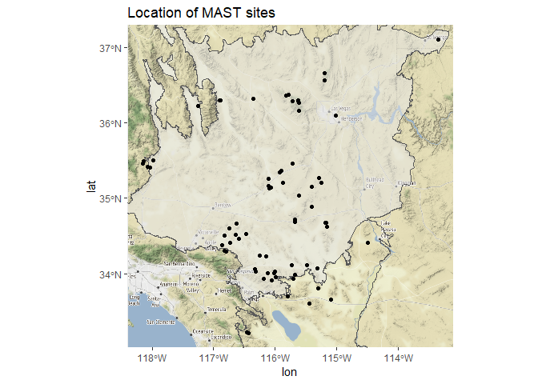

# Code from the MLRA 30 and 31 - Soil Climate Study

- [Project Description](https://github.com/smroecker/mast-mojave/blob/master/projectdescription.md)
- [Analysis](https://smroecker.github.io/mast-mojave/analysis_stephen.html)
- [Poster](https://www.researchgate.net/publication/331977150_Modeling_and_Application_of_Soil_Temperature_in_the_Mojave_and_Lower_Colorado_Deserts_of_California/citations)

<!-- -->
